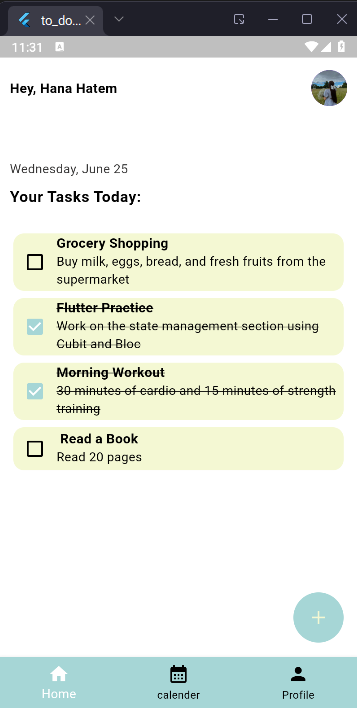

# To-Do App

A simple Flutter To-Do app to add, complete, and delete tasks with titles and descriptions.  
It uses Hive for local data storage, supports dark mode, and has calendar integration to show the current date.

## Features
- Add tasks with title and description
- Mark tasks as done
- Delete tasks by swiping
- Dark and light mode support
- View tasks by date with calendar

## Screenshots

<p float="left">
  
  
  
</p>

<p float="left">
  
  
</p>

## Getting Started
To run this project locally:

1. Clone the repository:
   ```bash
   git clone https://github.com/hanahatem1/todoApp
## Packages Used

- [Hive](https://pub.dev/packages/hive): A lightweight and fast key-value database for local data storage.
- [Hive Flutter](https://pub.dev/packages/hive_flutter): Hive integration to make it easier to use Hive with Flutter.
- [Table Calendar](https://pub.dev/packages/table_calendar): A package for displaying and interacting with calendars.
- [Intl](https://pub.dev/packages/intl): Provides internationalization and localization utilities for dates, numbers, and messages.
- [Cupertino Icons](https://pub.dev/packages/cupertino_icons): iOS-style icons for Flutter apps.
